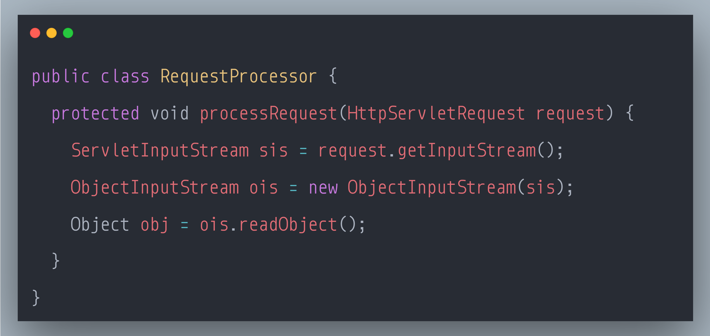

### SecurityExplained S-85: Vulnerable Code Snippet - 64

#### Vulnerable Code: 

#### Solution: 

This code is vulnerable to Insecure Deserialization Attack. 

User-provided data such as URL parameters, POST data payloads or cookies should always be considered untrusted and tainted. Deserialization based on data supplied by the user could result in two types of attacks:

Remote code execution attacks, where the structure of the serialized data is changed to modify the behavior of the object being unserialized.
Parameter tampering attacks, where data is modified to escalate privileges or change for example quantity or price of products.
The best way to protect against deserialization attacks is probably to challenge the use of the deserialization mechanism in the application. They are cases were the use of deserialization mechanism was not justified and created breaches (CVE-2017-9785).

If the use of deserialization mechanisms is valid in your context, the problem could be mitigated in any of the following ways:
- Instead of using a native data interchange format, use a safe, standard format such as untyped JSON or structured data approaches such as Google Protocol Buffers.

- To ensure integrity is not compromised, add a digital signature (HMAC) to the serialized data that is validated before deserialization (this is only valid if the client doesn’t need to modify the serialized data)

- As a last resort, restrict deserialization to be possible only to specific, whitelisted classes.

Reference: https://rules.sonarsource.com/java/type/Vulnerability/RSPEC-5135

Twitter Thread: https://twitter.com/harshbothra_/status/1507544881308188674

##### Code Credits: @SonarSource
 